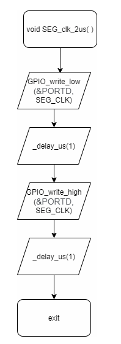

# Lab 5: Martin Šomšák
Link to GitHub repository: [Digital-electronics-2](https://github.com/MartinSomsak00/Digital-electronics-2)

https://github.com/MartinSomsak00/Digital-electronics-2

Link to [Assignment](https://github.com/MartinSomsak00/Digital-electronics-2/blob/main/Labs/05-segment/README.md)

https://github.com/MartinSomsak00/Digital-electronics-2/blob/main/Labs/05-segment/README.md

### 7-segment library

1. In your words, describe the difference between Common Cathode and Common Anode 7-segment display.
   * CC SSD - The common pin is connected to typically VCC. The input to LEDs in SSD is in mode 'active low' (active when input pin is connected to GND).
   * CA SSD - The common pin is connected to GND. The input to LEDs in SSD is in mode 'active high' (active when input pin is connected to VCC).
   
2. Code listing with syntax highlighting of two interrupt service routines (`TIMER0_OVF_vect`, `TIMER0_OVF_vect`) from counter application with at least two digits, ie. values from 00 to 59:
   
  ```c
uint8_t x = 0, y = 0;

ISR(TIMER1_OVF_vect)
{
    x++;
    if (x == 10){
        x = 0;
        y++;
        if (y == 6){
            y = 0;
        }
    }
}
ISR(TIMER0_OVF_vect)
{
    static uint8_t pos = 0;
    if (pos == 0){
        SEG_update_shift_regs(x,0);
    }
    else if (pos == 1){
        SEG_update_shift_regs(y,1);
    }
    pos++;
    if (pos > 1) {
        pos = 0;
    }
}
```
   
   3. Flowchart figure for function `SEG_clk_2us()` which generates one clock period on `SEG_CLK` pin with a duration of 2&nbsp;us. The image can be drawn on a computer or by hand. Use clear descriptions of the individual steps of the algorithms.
   
 