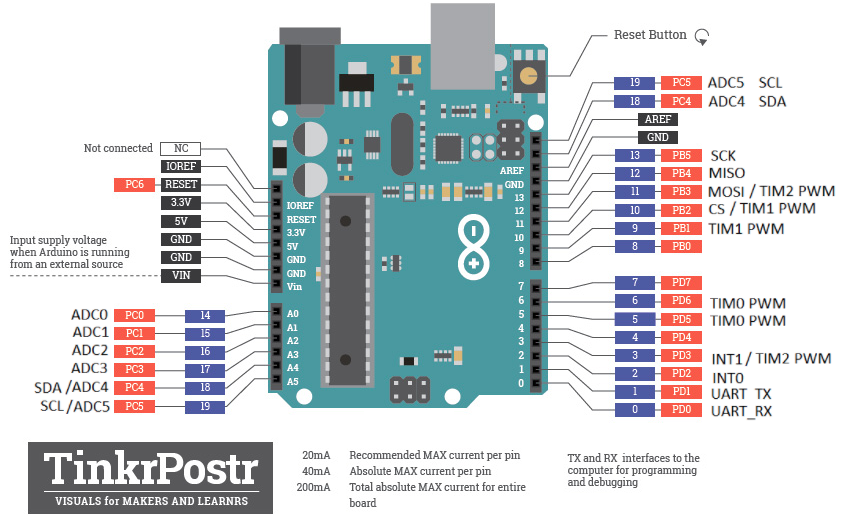

# Lab 8: Martin Šomšák
Link to GitHub repository: [Digital-electronics-2](https://github.com/MartinSomsak00/Digital-electronics-2)

https://github.com/MartinSomsak00/Digital-electronics-2

Link to [Assignment](https://github.com/MartinSomsak00/Digital-electronics-2/blob/main/Labs/08-i2c/README.md)

https://github.com/MartinSomsak00/Digital-electronics-2/blob/main/Labs/08-i2c/README.md

### Arduino Uno pinout

1. In the picture of the Arduino Uno board, mark the pins that can be used for the following functions:
   * PWM generators from Timer0, Timer1, Timer2
   * analog channels for ADC
   * UART pins
   * I2C pins
   * SPI pins
   * external interrupt pins INT0, INT1
   
   